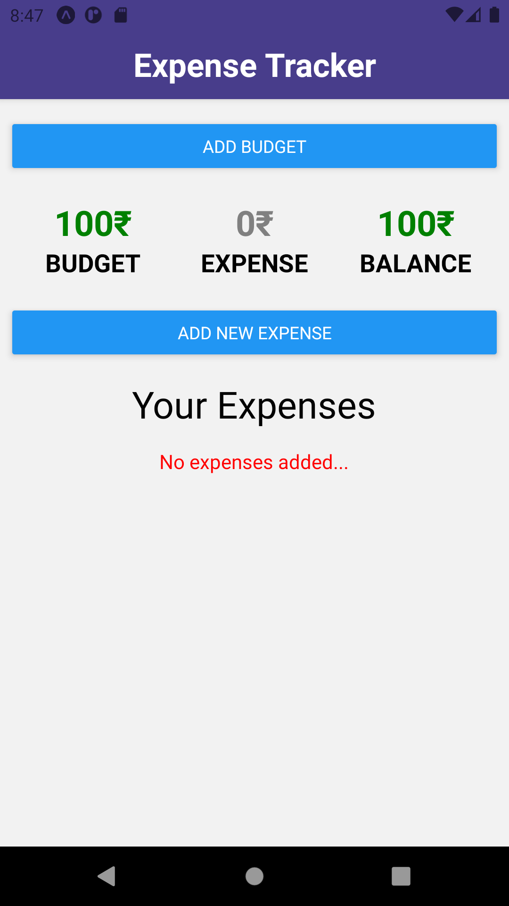
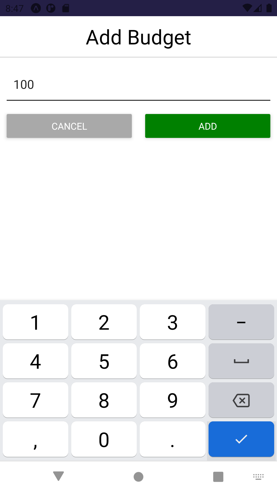
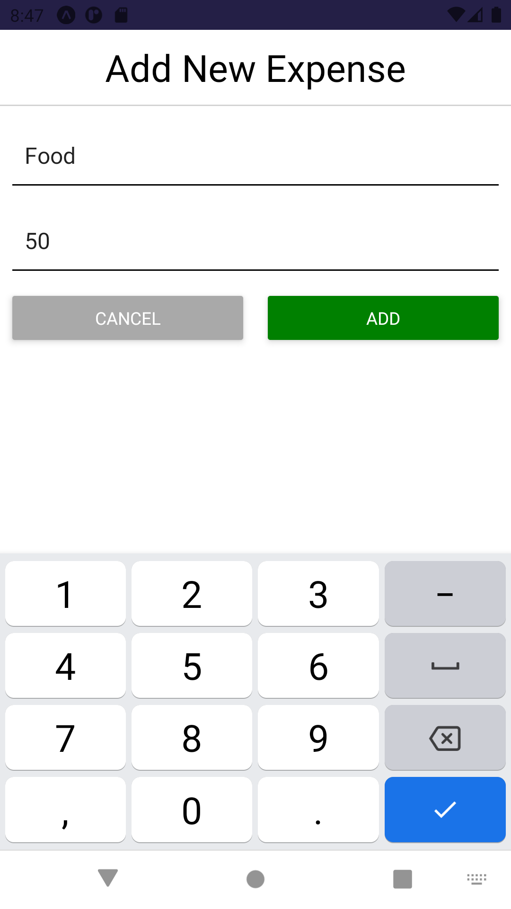
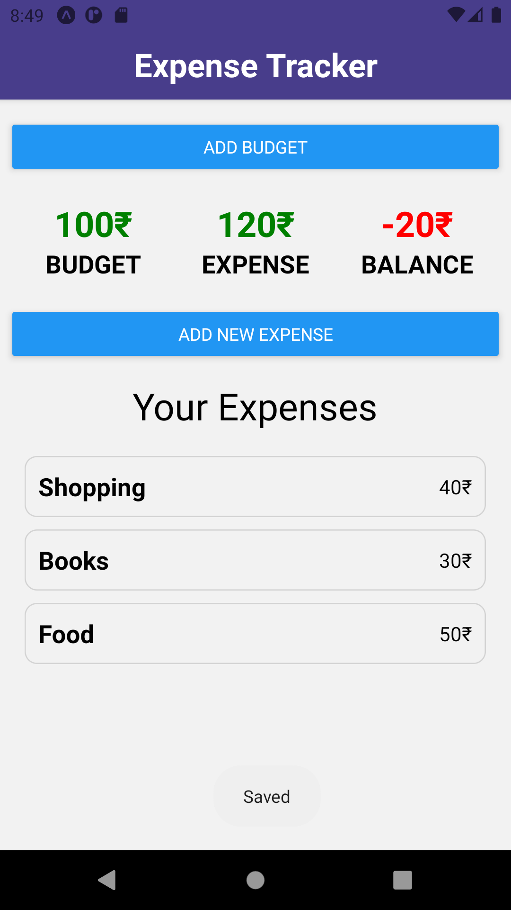
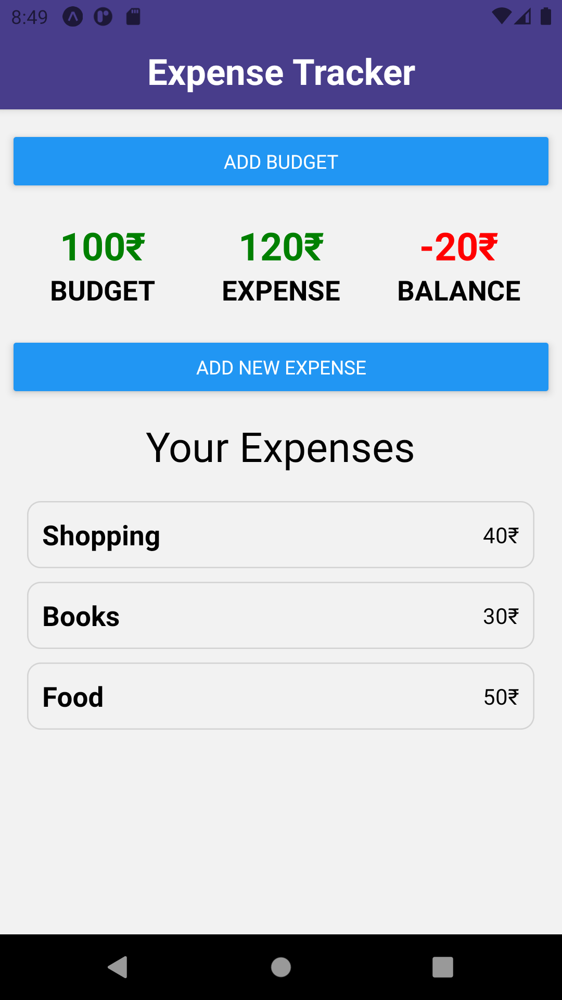
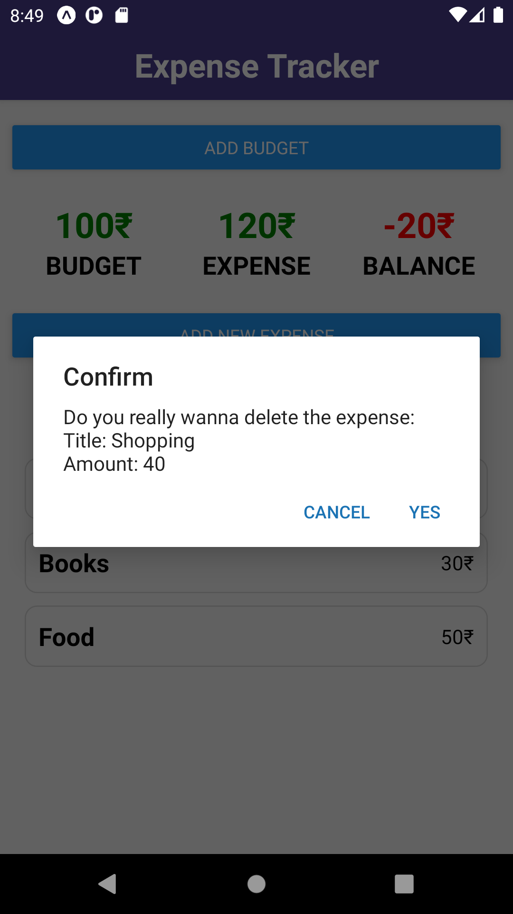
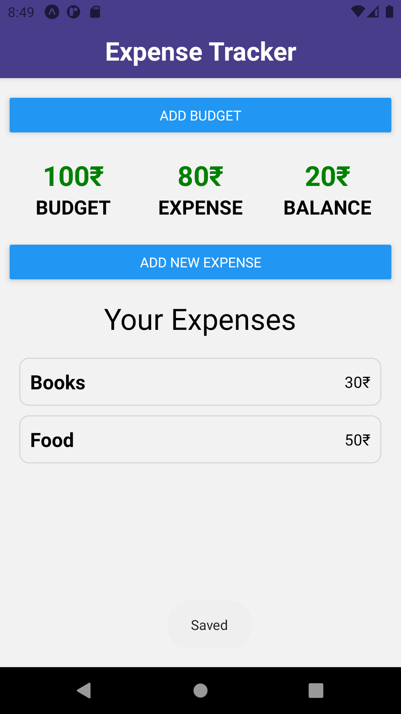

# Expense Tracker

A simple mobile application which can be used to track your expenses and maintain them.

### Screenshots

<h6>
#1 #4 #5 #6 #7 Home Screen | #2 Add Budget | #3 Add Expense
</h6>

> > [Web Preview](https://a7expensetracker.netlify.app/) > > [Web Repo](https://github.com/A7abhilash/expense-tracker)
